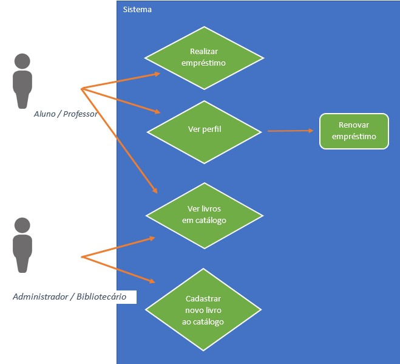
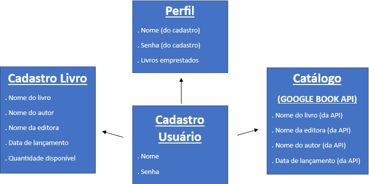
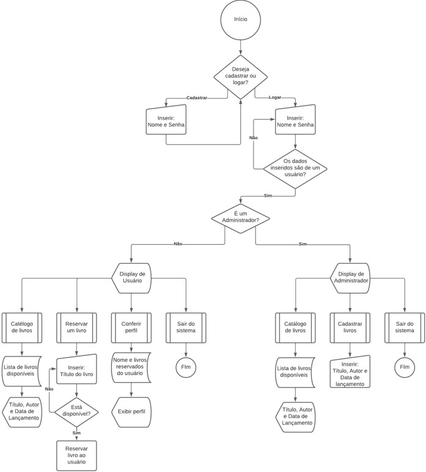

# Projeto com Arquitetura de Software
## Por: Pedro Henrique Resende Menezes

### Situação base: 
Imagine que uma instituição educacional deseja desenvolver um sistema de gerenciamento de biblioteca online para atender alunos, professores e funcionários. O objetivo é permitir que os usuários possam consultar o acervo de livros disponíveis, reservar exemplares, renovar empréstimos e realizar avaliações sobre as obras. Além disso, a biblioteca também precisa de um sistema para gerenciar o cadastro de livros, autores, editoras e outras informações relevantes.

## Fase 1: Levantamento de Requisitos 
### Requisitos do sistema: 
Biblioteca de livros disponíveis, Biblioteca de usuários, Books API
### Documentar os requisitos funcionais e não funcionais: 
. Funcionais: viabilizar o cadastro, login, visualização de livros disponíveis, reserva de exemplares para empréstimo e capacidade de adicionar exemplares à lista de livros .disponíveis. 
. Não funcionais: Capacidade de manutenção, escalabilidade, Google Book API e interoperabilidade entre sistema e usuário.
### Criar diagramas de caso de uso para representar as principais funcionalidades do sistema.

## Fase 2: Escolha do Estilo Arquitetural
### Estilo arquitetural: 
REST (Representational State Transfer), um esquilo que fornece padrões entre sistemas web que facilitam a comunicação dentre API e outros métodos funcionarem independentes um do outro. pois permite que diferentes informações dentre bancos de dados, APIs e métodos funcionem independente um do outro, permitindo assim o manuseio de cada um sem que afete o outro. Arquitetura escolhida devido os diferentes requisitos do sistema, que naturalmente, não dependem de pequenos serviços para alcançar suas demais funções. Pois o auxílio de informações vindas de uma aplicação apropriada, já será capaz de agregar positivamente ao projeto.

## Fase 3: Definição da Arquitetura
Baseado na escolha do estilo arquitetural, criar diagramas de arquitetura (por exemplo, diagramas de componentes, diagramas de implantação) para ilustrar a estrutura geral do sistema:

1. Perfil 
   - Renovar empréstimo
   - Ver informações do Usuário

2. Consultar acervo de livros
   - Ver detalhes do livro
   - Reservar exemplares

3. Realizar o cadastro de livros
   - Inserir informações requisitos e enviar

## Fase 4: Implementação do MVP (Minimum Viable Product)

### Utilizar UML para criar diagramas de classe e de sequência para auxiliar na implementação do MVP:

De classe:

De processo:

## Fase 5: Documentação e Entrega

### Projeto realizado pelos Stakeholders:
Pedro Henrique Resende Menezes: Analista de Sistemas
Emmanuel Martins: Gestor de projeto

A proposta é desenvolver um aplicativo bibliotecário universitário para reserva e renovação de livros emprestados do acervo disponibilizado pela instituição. Permite acesso e usos personalizados tanto ao público alvo de alunos e professores (subentendidos como “Usuários”), quanto aos funcionários (ou “Administradores”) contratados para usar tal sistema.

As funcionalidades do programa foram desenvolvidas com o propósito de além do cadastro e login dos usuários, permitir também que os mesmos: vejam a lista de livros disponibilizados, reservar unidades como empréstimo e renovar tal tempo cedido com o livro através de seu perfil. Enquanto isso, os Administradores são igualmente capazes de verem o acervo de livros (sobretudo os disponíveis ou não) e capaz de adicionar exemplares à lista de livros disponíveis. 

Suas utilidades foram estruturadas através do estilo arquitetural “REST”. Sua escolha se deve da flexibilidade desse método de permitir que diferentes processos (como bancos de dados, APIs e métodos) funcionem independente um do outro. Permitindo assim o manuseio de cada componente sem que um afete o outro. Ou seja, devido os diferentes requisitos do sistema, que naturalmente, não dependem de pequenos serviços para alcançar suas demais funções.

Tal arquitetura é válida para o sucesso do projeto ao permitir uma recursividade maior de seus processos. A exemplo está seus demais processos de apenas adição e exibição de dados, sem que eles precisem passar por alguma espécie de tratamento, logo serviços que dependam um dos outros não se encaixam no perfil apresentado em questão. Desse modo, a independência de seus processos é o que permite um desenvolvimento aliado a tecnologias mais apropriadas ao caso de uso. 

Concluímos que através da gestão e conhecimento desenvolvidos ao longo do projeto foi possível concluir a execução de sua proposta. Mesmo atrelado aos recursos disponíveis como tempo de entrega, experiência na linguagem de programação escolhida e funcionalidades da API utilizada, o resultado foi agradado quanto as funcionalidades então propostas. Futuros aperfeiçoamentos poderão ser feitos, como a inclusão de um Banco de Dados e o aprofundamento de outras funções da Google Books API nas funcionalidades do sistema. Porém, mesmo sem esses demais recursos, o sistema está totalmente operável e funcional, mostrando assim como sua arquitetura REST foi útil em sua construção.

